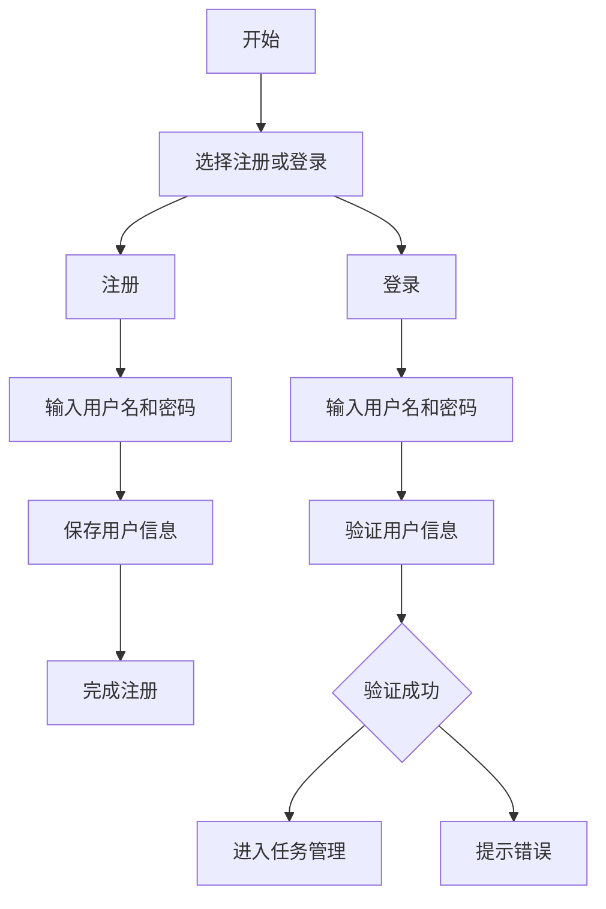
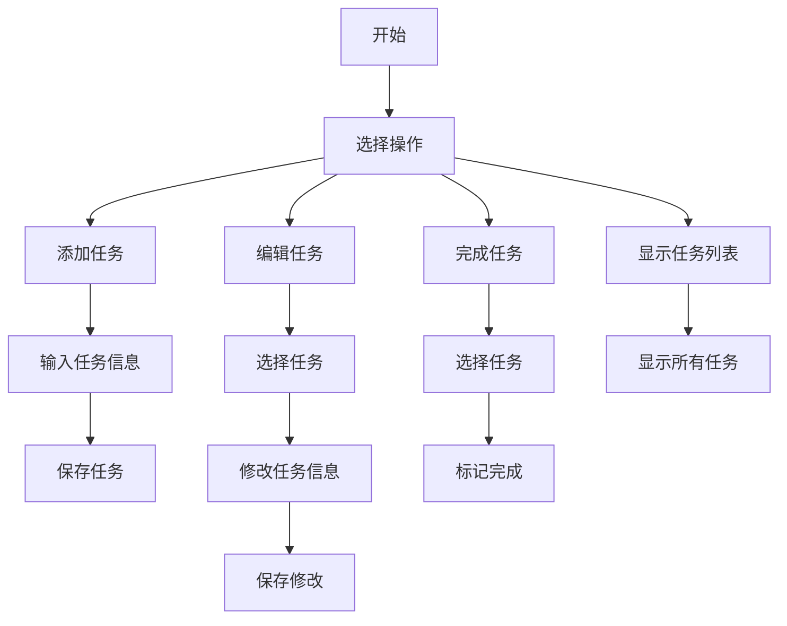

# 项目设计文档

- **登录界面**：
  
- **任务管理界面**：
  

## 模块与类设计
### 模块划分
- **用户管理模块**：负责用户的注册、登录和删除。
- **任务管理模块**：负责任务的添加、编辑、完成和显示。
- **提醒模块**：负责任务提醒功能。
- **命令行交互模块**：提供命令行模式的交互。
- **图形化界面模块**：提供任务管理的图形化界面。

### 类设计
#### User 类
- **属性**：用户名、密码哈希值
- **方法**：注册、登录、验证

#### Task 类
- **属性**：任务名称、截止日期、完成状态
- **方法**：设置任务、标记完成、编辑任务

#### TaskManager 类
- **属性**：任务列表
- **方法**：添加任务、编辑任务、删除任务、获取任务列表

#### Scheduler 类
- **属性**：任务管理器实例
- **方法**：设置提醒、跳过已完成任务

#### CommandLineInterface 类
- **属性**：任务管理器实例、调度器实例
- **方法**：命令行交互模式

## 流程图
### 用户注册与登录流程

### 任务管理流程

## 关键技术问题说明
- **问题 1**：如何实现任务提醒功能？
  - **解决方案**：使用 Qt 的定时器功能结合 Scheduler 模块。
- **问题 2**：如何支持中文显示？
  - **解决方案**：设置 Qt 的字符编码和字体。
- **问题 3**：如何设计高效的任务管理逻辑？
  - **解决方案**：使用 TaskManager 类集中管理任务，并通过 Scheduler 提供提醒功能。

---

**注**：请根据实际情况补充内容。
